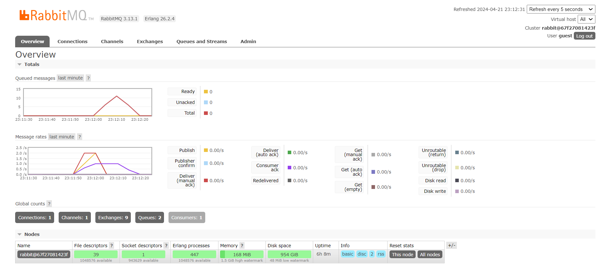

# Reflection Tutorial 8 Subscriber
**Nama : Virgillia Yeala Prabowo**

**Kelas : ADVPROG-A**

**NPM : 2206829856**

### Nomor 1
what is amqp?

Jawaban :

amqp adalah singkatan dari Advanced Message Queuing Protocol. Ini adalah protokol komunikasi yang digunakan untuk pertukaran pesan antara aplikasi atau sistem yang berbeda.
### Nomor 2
what it means? guest:guest@localhost:5672 , what is the first quest, and what is the second guest, and what is localhost:5672 is for?

Jawaban : 

"guest:guest@localhost:5672" adalah URI (Uniform Resource Identifier) yang digunakan untuk mengakses server AMQP. Di sini:
- "guest" adalah nama pengguna (username) pertama.
- "guest" adalah kata sandi (password) pertama.
- "localhost:5672" adalah alamat server AMQP yang diakses. "localhost" merujuk ke mesin yang sama dengan yang melakukan permintaan, dan "5672" adalah port standar untuk koneksi AMQP.

### My screen shows the RabbitMQ interface when I run cargo run multiple times on the publisher after using threads. Here, it can be seen that the queue reaches 11 because I ran cargo run 4 times.

> Ketika publisher mengirim pesan dengan cepat ke RabbitMQ, antrian terus bertambah setiap kali pesan baru dikirim. Sementara itu, subscriber mengkonsumsi pesan dengan kecepatan yang lebih lambat karena adanya penundaan yang disengaja selama 1 detik per pemrosesan pesan. Penundaan pemrosesan ini memungkinkan pesan-pesan untuk menumpuk dalam antrian.